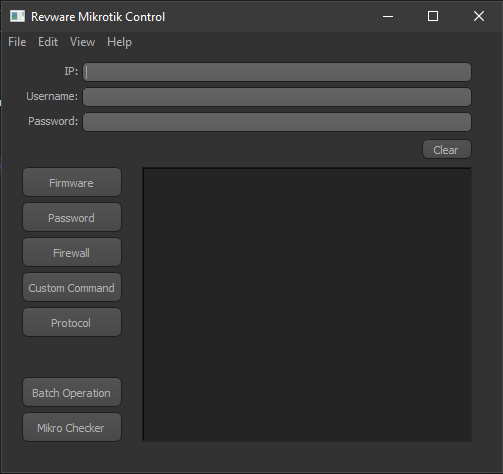

# Revware

Revware is a Python Tool to manipulate Mikrotik device(s) using Mikrotik API. Originally conceived by support staff at PocketiNet Communications to automate tasks that use to be done by point and click.

# Installation
  Run SetupRevware.exe

# Version
- 1.0.7
  - Firmware
  - Password
  - Radio Name
  - Custom Commands
  - Mass update and password
  - Mikrotik Poller

# Developers & Contributors

* [Revand](https://github.com/revand)
* [Deripsni](https://github.com/deripsni)
* [Orangedude27](https://github.com/orangedude27)
